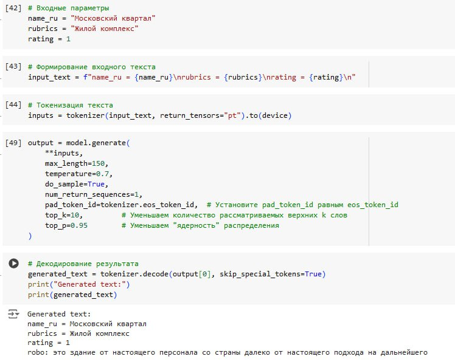
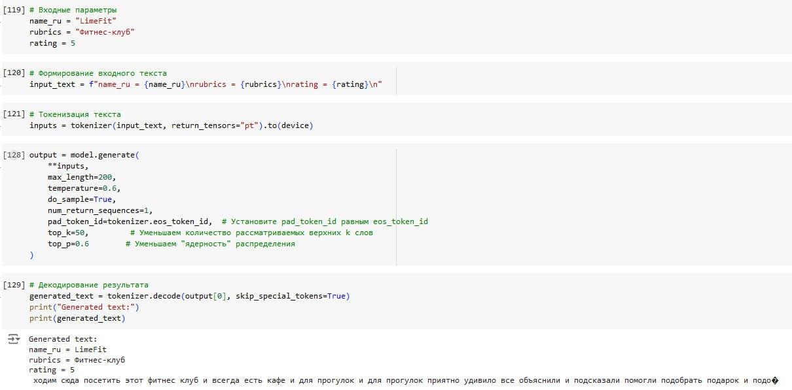
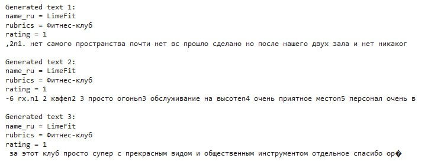
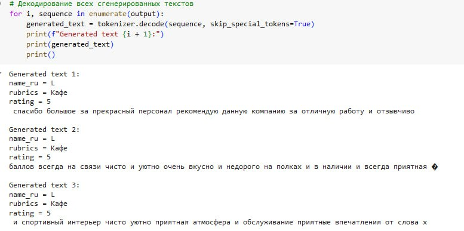
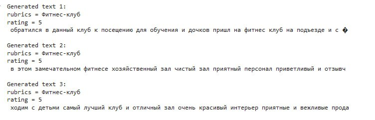
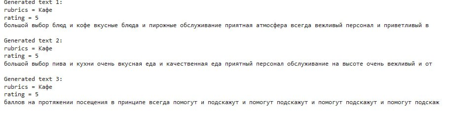
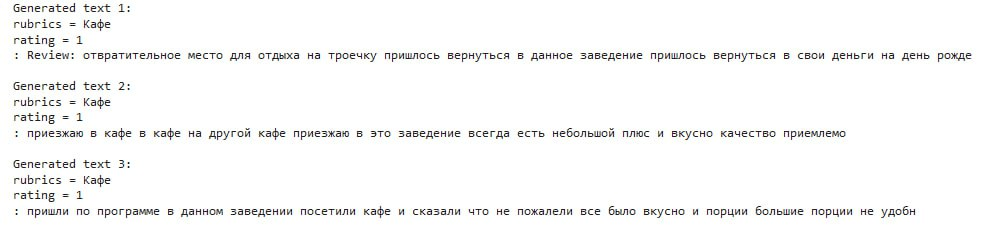

Ниже показаны примеры запуска модели с разными запросами  

Настройка параметров генерации + первый промт

Попробуем сменить категорию

пример вывода положительного отзыва, хотя в запросе была 1  

Далее из запроса была убрана строка name_ru, но на результат это не особо повлияло

аналогичная ситуация с положительным отзывом вместо негативного

